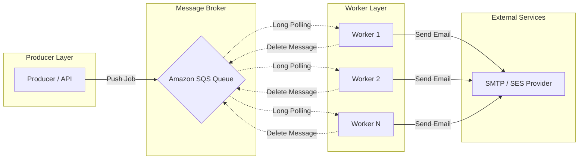

# SwiftSend - Newsletter Delivery Infrastructure

A distributed newsletter delivery system built using **Node.js** and **Amazon SQS**.

This project is a backend systems engineering exercise focused on learning scalable architecture patterns used in modern asynchronous systems such as email delivery platforms, notification infrastructure, and background job processing pipelines.

The system processes newsletter delivery requests asynchronously using a **queue-worker architecture**, decoupling request handling from background processing.

---

## High Level Design (HLD)

The following diagram illustrates the distributed architecture of the system:



---

## Project Objectives

The primary objective of this project is to understand and implement:

- **Asynchronous Job Processing**: Decoupling long-running tasks from the main API thread.
- **Distributed Worker Systems**: Scaling processing capacity by adding more worker instances.
- **Queue-Based Architectures**: Using message brokers to manage workload distribution.
- **Fault-Tolerant Systems**: Handling failures gracefully using visibility timeouts and retries.
- **Worker Orchestration**: Managing continuous polling loops and batch processing.
- **AWS SQS Integration**: Practical experience with enterprise-grade queuing services.

---

## System Architecture & Core Concepts

### Queue-Based Processing
Instead of sending emails synchronously during an API request, the system creates asynchronous jobs. This ensures the API remains responsive even under heavy load.

**Example message payload:**
```json
{
  "campaignId": "123",
  "email": "user@example.com",
  "subject": "Weekly Newsletter",
  "body": "Hello from the newsletter system"
}
```

### Background Workers
Workers operate in a continuous loop:
1. **Poll**: Retrieve messages from the SQS queue.
2. **Process**: Execute the email delivery job.
3. **Notify**: Send the email via SMTP/SES.
4. **Cleanup**: Delete the successfully processed message from the queue.

### Long Polling
The worker uses SQS long polling (`WaitTimeSeconds: 20`). This reduces:
- Unnecessary API requests to AWS.
- Idle CPU usage on worker instances.
- AWS request costs.

### Visibility Timeout
When a worker receives a message, it becomes temporarily invisible to other workers. If the worker fails to delete the message (due to a crash or error) within the timeout period, the message becomes visible again for another worker to retry.

---

## Features

- [x] **Amazon SQS Integration**: Native AWS SDK v3 integration.
- [x] **Asynchronous Producer**: Fast job creation and ingestion.
- [x] **Continuous Worker**: Robust polling loop for job consumption.
- [x] **Batch Processing**: Support for batch message retrieval and deletion.
- [x] **SMTP Delivery**: Integrated with Nodemailer for Gmail/SES delivery.
- [x] **Long Polling**: Optimized for cost and performance.
- [x] **Error Handling**: Basic retry logic via Visibility Timeout.

---

## Tech Stack

- **Backend**: Node.js, TypeScript
- **Message Broker**: Amazon SQS
- **Email Delivery**: Nodemailer (Gmail SMTP / SES)
- **Runtime**: tsx (for development)

---

## Project Structure

```text
backend/
├── src/
│   ├── producer/    # Logic for creating and pushing jobs to SQS
│   ├── worker/      # Logic for consuming and processing jobs
│   ├── utils/       # Shared utilities (Mail Agent, AWS Config)
│   ├── db/          # Database connection and models
│   ├── env/         # Environment variable configuration
│   ├── scripts/     # Test scripts and manual triggers
│   └── index.ts     # API entry point
├── .env             # Configuration (AWS keys, SMTP credentials)
├── package.json     # Dependencies and run scripts
└── tsconfig.json    # TypeScript configuration
```

---

## Local Development

### 1. Prerequisites
- Node.js (v18+)
- AWS Account with SQS Queue access
- Gmail App Password (if using Gmail SMTP)

### 2. Setup
```bash
# Navigate to backend directory
cd backend

# Install dependencies
npm install

# Configure environment variables
cp .env.example .env # Ensure you fill in your AWS and SMTP details
```

### 3. Running the System
```bash
# Start the Producer (API)
npm run producer

# Start the Worker Fleet
npm run worker

# Run a test delivery script
npm run test-send
```

---

## Learning Focus & Roadmap

### Current Focus
- Distributed workers & Asynchronous processing
- Horizontal scalability & Queue-driven communication
- Fault tolerance & Worker orchestration

### Planned Improvements
- **Infrastructure**: EC2 deployment with Auto Scaling Groups.
- **Reliability**: Dead Letter Queues (DLQ) and Idempotency handling.
- **Monitoring**: CloudWatch integration for queue depth and error rates.
- **Features**: Scheduled campaigns and delivery analytics dashboard.
